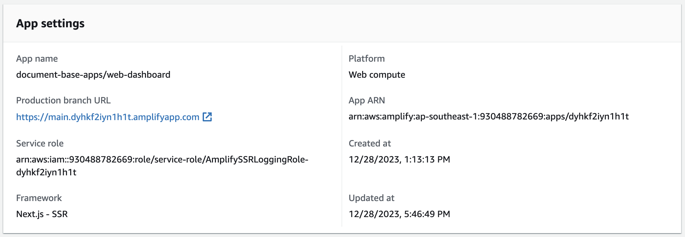
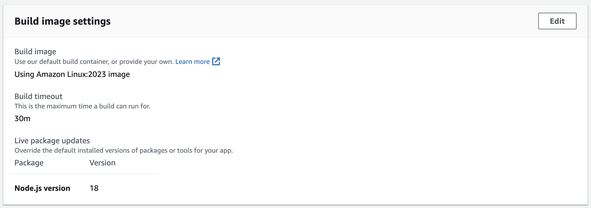

# How To Deploy

This guidance to deploy nextjs application and hosting into AWS amplify. why this doc is occurs is to reduce time to debug and testing and solve issue while experimenting.

## Pre-Requisite

- Nx as monorepo tools
- Next it self and @nx/next
- AWS account

### AWS Amplify Configuration

#### General Settings

**App Settings**


> **Important to know**
> If the "Framework" and "Platform" is not set as is in the image please follow this steps

1. Setting each branch to framework 'Next.js - SSR' :

```bash
aws amplify update-branch --app-id <APP_ID> --branch-name <BRANCH_NAME> --framework 'Next.js - SSR' --region <REGION>

#example
aws amplify update-branch --app-id d28lhotc31ijs4 --branch-name main --framework 'Next.js - SSR' --region ap-southeast-1
```

2. Setting the app platform to WEB_COMPUTE :

```bash
aws amplify update-app --app-id <APP_ID> --platform WEB_COMPUTE --region <REGION>

# example:
aws amplify update-app --app-id d28lhotc31ijs4 --platform WEB_COMPUTE --region ap-southeast-1
```

#### Build Setting

**App build specification**

amplify.yml as build setting file

```yaml
version: 1
applications:
  - frontend:
      phases:
        preBuild:
          commands:
            - npm install
        build:
          commands:
            # - npx nx build <PACKAGE_NAME>
            - npx nx build web-dashboard
      artifacts:
        # baseDirectory: dist/packages/<PACKAGE_NAME>/.next
        baseDirectory: dist/packages/web-dashboard/.next
        files:
          - '**/*'
      # Disable cache config when you face issue about missing next module
      cache:
        paths:
          - node_modules/**/*
      buildPath: /
    # appRoot: packages/<PACKAGE_NAME>
    appRoot: packages/web-dashboard
```

> When use face some issue about could not `next` module try to comment line cache config on build config above.

**Build Image Setting**
Follow this settings


**Environment Variables**


Set the `AMPLIFY_MONOREPO_APP_ROOT=/` this is root of workspace not root of packages/apps

this error will be occurs if `AMPLIFY_MONOREPO_APP_ROOT=/` not setting up properly.

```
!!! CustomerError: Cannot read 'next' version in package.json.
If you are using monorepo, please ensure that AMPLIFY_MONOREPO_APP_ROOT is set correctly.
```

### Useful Reference

- [How to deploy Next to AWS Amplify](https://docs.aws.amazon.com/amplify/latest/userguide/monorepo-configuration.html)
- [How to deploy Next to AWS Amplify with Nx Monorepo](https://aws.amazon.com/blogs/mobile/share-code-between-next-js-apps-with-nx-on-aws-amplify-hosting/)
- [Github Example Project](https://github.com/kevinold/banking-web-apps)
